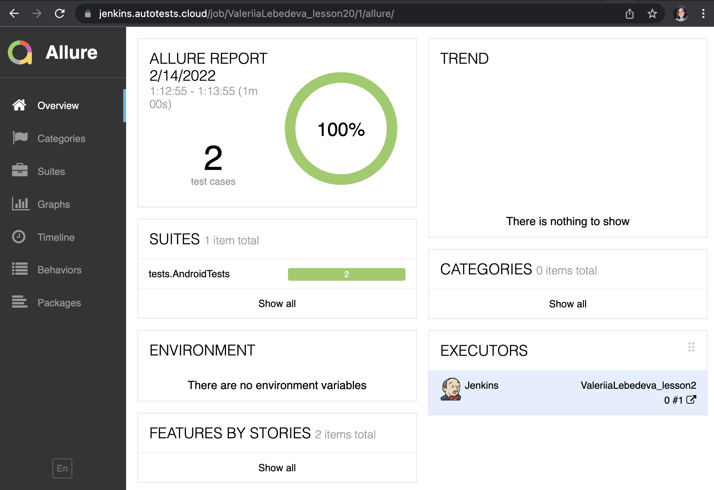
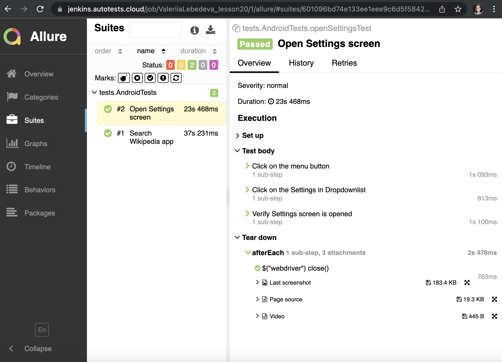
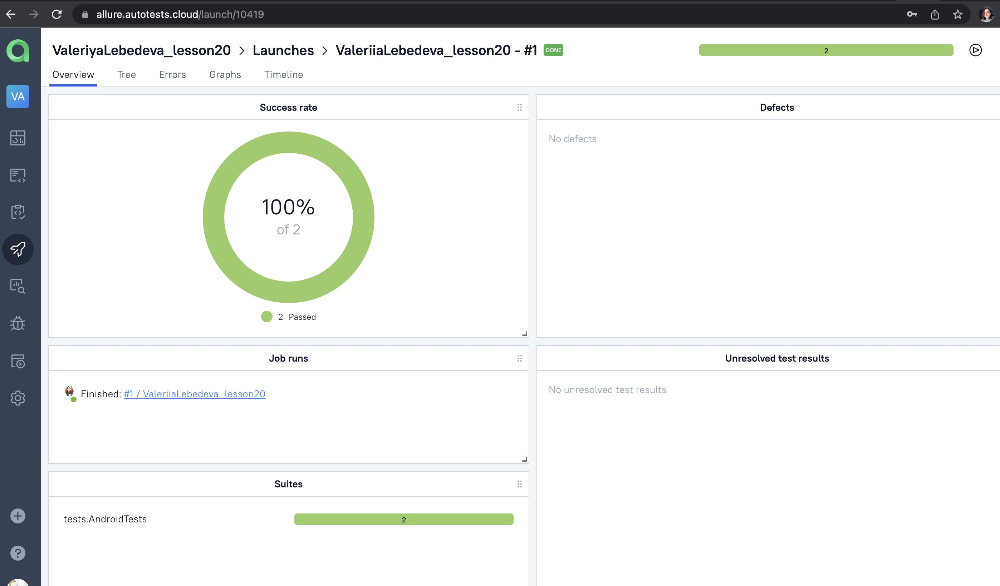
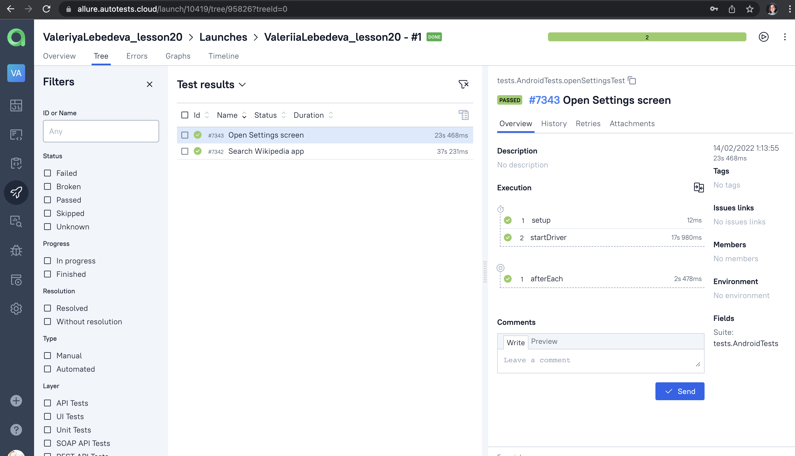

# Wikipedia app mobile tests (local device, browserstack)

# USAGE examples
## Run tests from terminal
##### (Don't forget to add the configuration files:
##### - src/test/resources/config/browserstack.properties
##### see congig files examples here: src/test/resources/config)

## Run tests from terminal locally

### Run tests on Browserstack:

```bash
gradle clean browserstack
```

### Run tests on Android studio emulator using Appium server:

```bash
gradle clean local
```


### Serve report:

```bash
allure serve build/allure-results
```

# Jenkins job
#### To run test in browserstack
### https://jenkins.autotests.cloud/job/ValeriiaLebedeva_lesson20/

####How to build project: 
#### 1. Click on the 'Build now'

# Allure report examples

<p align="center">
  
</p>

Each test has steps described and attachments:
<p align="center">
  
</p>

#### Attachments you may find here:
#### https://jenkins.autotests.cloud/job/ValeriiaLebedeva_lesson20/1/allure/
#### (select suits item -> select test -> enjoy :innocent:)


# Allure TestOps integration

<p align="center">
  
</p>

<p align="center">
  
</p>


